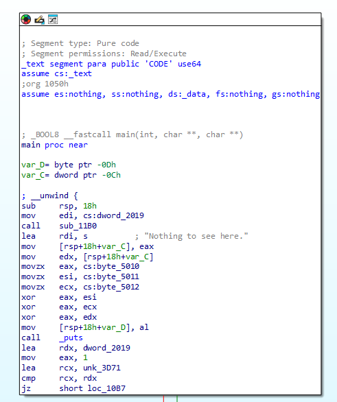
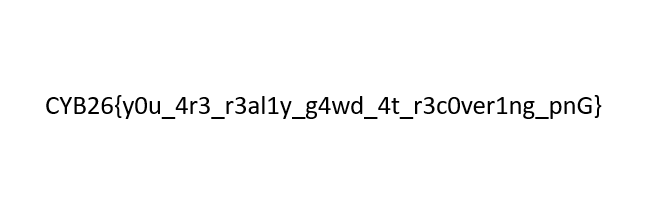

# graphics - Proof of Concept

> Cybreak 2026 - Reverse Engineering - Easy - graphics

We were given a stripped ELF binary. `file challenge` identifies it as an `ELF 64-bit LSB pie executable, x86-64, version 1 (SYSV), dynamically linked, interpreter /lib64/ld-linux-x86-64.so.2, for GNU/Linux 3.2.0, stripped`. 

## Decompile

Executing it prints `Nothing to see here.`, so we open it in IDA Free.



The main function calls `sub_11B0` using data from `.rodata`. Decompiling it, we get:

```c
_BOOL8 __fastcall main(int a1, char **a2, char **a3)
{
  unsigned int decoded_word; // [rsp+Ch] [rbp-Ch]
  char marker; // [rsp+Bh] [rbp-Dh]

  decoded_word = sub_11B0(705429519);
  marker = byte_5010 ^ byte_5011 ^ byte_5012 ^ decoded_word;
  puts(s: "Nothing to see here.");
  if ( &unk_3D71 != (_UNKNOWN *)&byte_2019 )
    return marker == 0;
  return true;
}

__int64 __fastcall sub_11B0(int value)
{
  return (unsigned int)__ROL4__(value, 8);
}
```

The value `705429519` comes from `dword_2019`. The `sub_11B0` function rotates it left by 8 bits. The bytes at `byte_5010` are also used in the check:

```text
$ xxd -s 0x5000 -l 19 -g 1 challenge
00005010: 43 59 42                                         CYB
```

So, we get the XOR key: `CYB`.

## Solving

As shown in the main function, the data starts at `0x2019` and ends at `0x3d71`. `readelf -l challenge` shows that the `.rodata` segment has matching file offsets and virtual addresses, so these addresses can be used as offsets in the ELF file.

The payload is Base64-encoded, XORed with `CYB`, then every little-endian 32-bit word is rotated right by 8 bits. To recover the PNG, we rotate every word left by 8 bits, XOR it with the key, then Base64-decode it:

```py
from base64 import b64decode
from pathlib import Path

binary = Path("challenge").read_bytes()
ciphertext = binary[0x2019:0x3D71]
key = b"CYB"

unrotated = b"".join(
    word[-1:] + word[:-1]
    for word in (ciphertext[offset:offset + 4] for offset in range(0, len(ciphertext), 4))
)

encoded_png = bytes(
    byte ^ key[index % len(key)]
    for index, byte in enumerate(unrotated)
)

assert encoded_png.startswith(b"iVBORw0KGgo")
Path("recovered.png").write_bytes(b64decode(encoded_png, validate=True))
```

The output is the original PNG file:

```text
$ file recovered.png
recovered.png: PNG image data, ...
```


```text
CYB26{y0u_4r3_r3al1y_g4wd_4t_r3c0ver1ng_pnG}
```