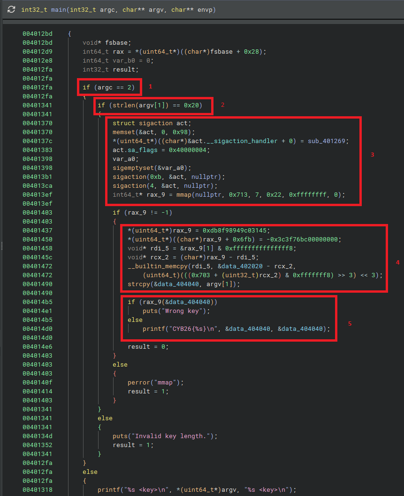
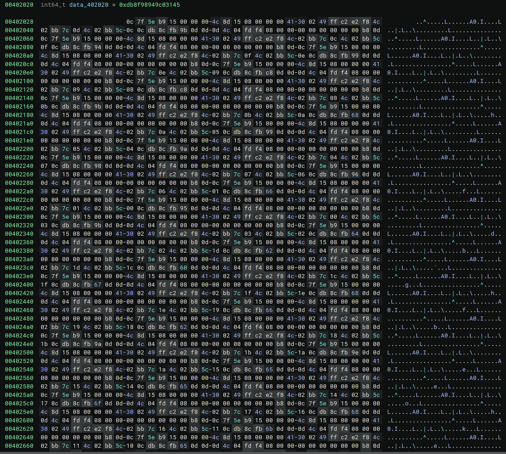
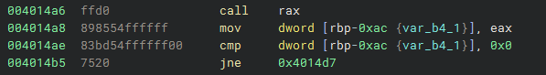

# stop, wait a minute — Solve writeup

## TL;DR

Given an ELF that takes an argument for a key

```
$ ./halt
./halt <key>
```

Decompiling the main function, we can see:



1. The program expecting 1 argument to be included (the <key>)
2. The argument expected length is 32 char (0x20 in hexadecimal is 32 in decimal)
3. The program setting up a custom signal handler
4. The program setting up a shellcode execution
5. The program running the shellcode as a validator

If we were to take a look at the shellcode, we would see that it is gibberish, indicating that the shellcode is encrypted



When dealing with encrypted binary like these, the most common approach is to dump the encrypted blob AFTER it has finished decrypting. With enough assumption, one can come to the conclusion that the shellcode is decrypted at runtime, checks the flag, and then returns the result. And so, we will be using gdb for the debugger. Actually, before we start debugging, it wouldnt be a stretch to assume that signals will play some role in this binary/shellcode given the custom handler. With that in mind, we can prepare the debugger by having gdb not terminate on these signals by using:

```
gdb ./halt                          # starts gdb debugger on our binary
handle SIGSEGV nostop noprint pass  # tell gdb to not stop, not print anything, and skip on segmentation fault signal
handle SIGILL nostop noprint pass   # tell gdb to not stop, not print anything, and skip on illegal instruction signal
```

Now we need to determine where to put our breakpoint.



Here we can see the call to the shellcode (stored in rax) and the immediate instructions. We can put the breakpoint in any of these, i would recommend putting it AFTER the call instruction for safekeeping. Lets say, for the sake of this writeup, we put the breakpoint in the mov instruction, which means we will be putting a breakpoint in the address 0x4014a8. However this address is following the base virtual address set by the decompiler, which could be different from what the actual base address is in your machine. Now i know that the base address set by my decompiler starts in 0x400000 so i can just subtract it and get the relative address 0x14a8. Next, to know what the virtual address of your machine is, you can run this command in gdb:

```
(gdb)  info proc mappings
process 10372
Mapped address spaces:

Start Addr         End Addr           Size               Offset             Perms File
0x0000555555554000 0x0000555555555000 0x1000             0x0                r--p  /[REDACTED]/halt
0x0000555555555000 0x0000555555556000 0x1000             0x1000             r-xp  /[REDACTED]/halt
0x0000555555556000 0x0000555555557000 0x1000             0x2000             r--p  /[REDACTED]/halt
0x0000555555557000 0x0000555555559000 0x2000             0x2000             rw-p  /[REDACTED]/halt
0x00007ffff7fba000 0x00007ffff7fbe000 0x4000             0x0                r--p  [vvar]
0x00007ffff7fbe000 0x00007ffff7fc0000 0x2000             0x0                r-xp  [vdso]
0x00007ffff7fc0000 0x00007ffff7fc1000 0x1000             0x0                r--p  /usr/lib/x86_64-linux-gnu/ld-linux-x86-64.so.2
0x00007ffff7fc1000 0x00007ffff7ff0000 0x2f000            0x1000             r-xp  /usr/lib/x86_64-linux-gnu/ld-linux-x86-64.so.2
0x00007ffff7ff0000 0x00007ffff7ffb000 0xb000             0x30000            r--p  /usr/lib/x86_64-linux-gnu/ld-linux-x86-64.so.2
0x00007ffff7ffb000 0x00007ffff7ffe000 0x3000             0x3b000            rw-p  /usr/lib/x86_64-linux-gnu/ld-linux-x86-64.so.2
0x00007ffff7ffe000 0x00007ffff7fff000 0x1000             0x0                rw-p
0x00007ffffffdd000 0x00007ffffffff000 0x22000            0x0                rw-p  [stack]
```

Here we can see that the base address is 0x0000555555554000 so our breakpoint should be in 0x0000555555554000 + 0x14a8 = 0x5555555554a8

In gdb, we can run this command:

```
break *0x5555555554a8                  # sets the breakpoint
run 12345678901234567890123456789012   # runs the binary with the provided argument
```

Now once the breakpoint hit, we can dump the shellcode. But where is the shellcode exactly? Going back to our decompiler, we can see that in the main function, the program called mmap, which basically reserves a region in the memory, and returns the address of that region.

```
int64_t* rax_9 = mmap(nullptr, 0x713, 7, 0x22, 0xffffffff, 0);
```

We only care about the first two numbers. 0x713, which is the size of the region reserved, and 7, which indicates what type of region is allocated. 7 translates to read (4), write (2), execute (1). The address mmap hands back is saved in a local variable (var_b0_1, at [rbp-0xa8]) (can be seen in the disassembly)

```
004013ef  e83cfdffff         call    mmap
004013f4  48898558ffffff     mov     qword [rbp-0xa8 {var_b0_1}], rax
```

With that information, we can dump the extracted shellcode using this command

```
set $buf = *(unsigned long *)($rbp - 0xa8)   # read the mmap'd buffer pointer stored in main's local variable
dump binary memory blob.bin $buf $buf+0x713  # dump from the buffer start to start + 0x713
```

And now, we can see what the shellcode does. There are many ways to analyze shellcode, the one i will be using in this writeup is ndisasm

```
$ ndisasm -b 64 blob.bin
00000000  4531C0            xor r8d,r8d
00000003  4989F9            mov r9,rdi
00000006  B80D0C7F5E        mov eax,0x5e7f0c0d
0000000B  B915000000        mov ecx,0x15
00000010  4C8D1508000000    lea r10,[rel 0x1f]
00000017  413002            xor [r10],al
0000001A  49FFC2            inc r10
0000001D  E2F8              loop 0x17
0000001F  410FB67100        movzx esi,byte [r9+0x0]
00000024  410FB65101        movzx edx,byte [r9+0x1]
00000029  01D6              add esi,edx
0000002B  81F696000000      xor esi,0x96
00000031  4109F0            or r8d,esi
00000034  F4                hlt
...
```

Looking at the output, we can see a repeating pattern. The shellcode is basically a chain of 32 nearly identical blocks, executed one after another. There are no loops or branches between the blocks, they simply run in order.

Each block has three parts:

1. A small decryptor stub, which decrypts the next 21 bytes in place before the check can run. This is why the blob inside the binary looked like gibberish, only the copy running in memory ever gets decrypted, piece by piece.
2. The check itself, which loads two characters of our key, adds them together, and xors the result with a hardcoded constant. Since xoring a value with c gives 0 if and only if the value is equal to c, this is basically a way to check whether key[n] + key[n+1] is equal to c. If it is, the result is 0 and nothing happens, if not, the result is nonzero and gets remembered.
3. The hlt instruction, which crashes the program in user mode. But remember the custom signal handler from main? That handler catches the crash and jumps to the next block instead. So each hlt is basically a hidden jump to the next block.

Notice that a wrong key doesn't stop the program. Every block still runs, and every failed check just gets OR'ed into one shared register (r8d), which works like a fail counter. After the last block, a tiny epilogue returns that counter to main, where 0 means every check passed, and anything else means the key is wrong.

The last block is also a bit different. Instead of checking two characters, it only checks one character directly (key[31] == 0x33, which is the character '3'). This detail matters, because a chain of sums alone would have multiple possible keys, and this direct check pins down the solution so it is unique.

So to solve it, we start from the last block, which gives us key[31] directly, and then work backwards through the chain, one subtraction per block (key[n] = c_n - key[n+1]).

With that, we can infer the correct key to be 0f3ada50d3b92f09673296a262051763. And verified:

```
$ ./halt 0f3ada50d3b92f09673296a262051763
CYB26{0f3ada50d3b92f09673296a262051763}
```

## Flag

`CYB26{0f3ada50d3b92f09673296a262051763}`

